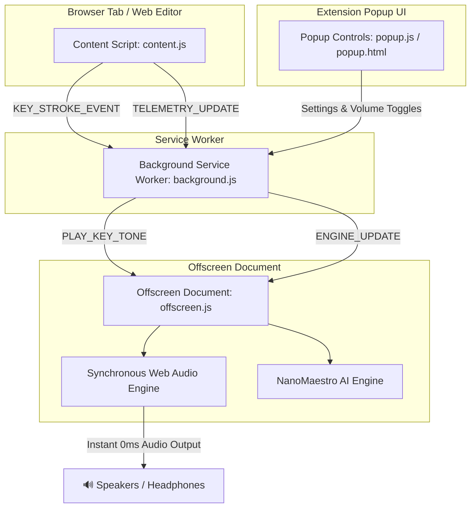

# 🎹 TypeMaestro

> **Instant, per-keystroke instrument tones & ambient piano music dynamically matched to your typing rhythm.**

[](https://developer.chrome.com/docs/extensions/mv3/intro/)
[](https://vitejs.dev/)
[](https://huggingface.co/docs/transformers.js)
[](https://opensource.org/licenses/ISC)

**TypeMaestro** is a Manifest V3 Chrome Extension that turns your keyboard into a real-time musical instrument and personalized focus soundscape. As you type, TypeMaestro plays deterministic, instant per-key instrument tones and analyzes your typing pace (WPM, burstiness, backspace frequency) to synthesize responsive background ambient piano music on the fly using a Web Audio synthesis engine.

---

## 🌟 Key Features

* **⚡ 0ms Real-Time Keystroke Feedback**: Instant, zero-latency instrument audio output (`playInstrumentToneSync`) on every single keypress with crisp attack transients.
* **🔒 1-to-1 Fixed Pitch Mapping**: Every single key on your keyboard (`a`–`z`, `0`–`9`, Spacebar, Enter, Backspace, Delete, Tab) is deterministically bound to its own unique musical pitch:
  * **`r`** ➔ **A#3 (Note 58)** *(consistently plays the exact same tone every time `r` is pressed)*
  * **`a`** ➔ **C4 (Note 60)**
  * **`e`** ➔ **E4 (Note 64)**
  * **`t`** ➔ **E5 (Note 76)**
  * **Spacebar** ➔ **Low Bass C3 (Note 48)**
  * **Enter** ➔ **High C6 (Note 96)**
  * **Uppercase (`Shift + Key`)** ➔ Transposed 1 octave higher (+12 semitones).
* **🎷 5 Selectable Instrument Timbres**:
  * 🎹 **Grand Piano**: Dual-oscillator acoustic piano synthesis with sub-octave warmth.
  * 🔔 **Crystal Chimes**: Shiny high-frequency bell ring with metallic harmonic shimmer.
  * 🪵 **Wood Marimba**: Woody percussive attack with lowpass biquad filtering.
  * 👾 **Retro Synthesizer**: Classic 8-bit vintage square wave synth lead.
  * 🌌 **Ethereal Pad**: Smooth sine/triangle swell with spacious reverberation.
* **🎛️ Independent Volume & Toggle Controls**:
  * **⚡ Extension Power Toggle**: Master extension on/off switch.
  * **🎵 Keystroke Tones Toggle**: Toggle per-key instrument sounds.
  * **🎼 Ambient Music Flow Toggle**: Toggle background ambient music generation (OFF by default for distraction-free typing).
  * **🎚️ Dual Volume Sliders**: Independent sliders for **Keystroke Tones Volume** and **Ambient Music Volume**, plus **Master Volume**.
* **🌐 Web Editor Compatibility**: Injects capture-phase listeners to reliably intercept keypresses across Monaco Editor / VS Code Web (`vscode.dev`), CodeMirror, Ace, ProseMirror, Slate, Google Docs, Notion, and standard input fields.
* **🧠 Hybrid Generative Audio Engine**:
  * **On-Device AI Inference**: Powered by [`@xenova/transformers`](https://github.com/xenova/transformers.js) running `utkucoban/NanoMaestro-Realtime` directly inside your browser.
  * **Procedural Algorithmic Fallback**: Instant fallback generator using harmonic scale intervals and dynamic velocity mapping when offline or loading the model.
* **🔒 100% On-Device Privacy**: Keystroke timing metadata is processed locally in temporary memory. Text content is **never** saved, logged, or transmitted over the network.
* **🧹 Garbage-Collected Audio Graph**: Automatic Web Audio node cleanup (`autoCleanup`) prevents memory leaks, CPU spikes, or browser freezing during rapid typing.

---

## 🏗️ Architecture & Data Flow

TypeMaestro uses a high-performance Manifest V3 architecture optimized for zero-latency audio synthesis:



1. **Content Script (`content.js`)**: Captures keydown events in the capture phase across standard inputs and complex web editors (Monaco/VS Code Web, CodeMirror, etc.), sending immediate key events and calculating sliding-window telemetry (WPM, burstiness, backspaces, pause duration).
2. **Service Worker (`background.js`)**: Maintains the offscreen document lifecycle (`setupOffscreenDocument`) and forwards key tone events and settings updates.
3. **Offscreen Document (`offscreen.js`)**: Hosts the Web Audio synthesis engine (`playInstrumentToneSync`) and AI inference loop off the main thread for uninhibited, zero-lag performance.
4. **Popup UI (`popup.html` / `popup.js`)**: Modern dark-mode interface with live WPM statistics, independent feature toggles, instrument selector dropdown, and separate volume controls.

---

## 📁 Repository Structure

```text
TypeMaestro/
├── src/
│   ├── manifest.json       # Manifest V3 extension configuration
│   ├── background.js       # Background service worker & offscreen manager
│   ├── content.js          # Injected telemetry & capture-phase key listener
│   ├── offscreen.html      # Offscreen audio host document & media keepalive
│   ├── offscreen.js        # Synchronous Web Audio synth & AI generation model
│   ├── popup.html          # Extension popup UI layout
│   └── popup.js            # Popup settings controller & live WPM display
├── package.json            # Dependencies & build scripts
├── vite.config.js          # Vite build configuration with @crxjs/vite-plugin
└── README.md               # Project documentation
```

---

## 🚀 Getting Started

### Prerequisites

* [Node.js](https://nodejs.org/) (v18 or higher recommended)
* Google Chrome or any Chromium-based browser (Brave, Edge, Vivaldi)

### 1. Installation

Clone the repository and install dependencies:

```bash
git clone https://github.com/anonyxhappie/TypeMaestro.git
cd TypeMaestro
npm install
```

### 2. Build the Extension

Run the build script to generate the production extension bundle:

```bash
npm run build
```

The compiled extension files will be created in the `dist/` directory.

### 3. Load in Google Chrome

1. Open Google Chrome and navigate to `chrome://extensions/`.
2. Enable **Developer mode** in the top right corner.
3. Click **Load unpacked**.
4. Select the `dist` folder inside the `TypeMaestro` project directory.
5. Pin TypeMaestro to your browser toolbar for quick access!

---

## 🎛️ Usage Guide

1. **Keystroke Tones**: Type into any input field or web editor (`vscode.dev`, Google Docs, Notion). Pressing any key immediately plays its bound tone on your selected instrument.
2. **Select Instrument**: Open the popup and select your instrument timbre (*Grand Piano*, *Crystal Chimes*, *Wood Marimba*, *Retro Synth*, or *Ethereal Pad*).
3. **Ambient Music Flow**: By default, ambient background music is turned off. Toggle **Ambient Music Flow** ON in the popup if you'd like dynamic background melodies matched to your typing speed.
4. **Adjust Volumes**: Use the independent **Keystroke Tones Volume** and **Ambient Music Volume** sliders to set the perfect mix for your workflow.

---

## 📊 Telemetry & Audio Synthesis Technical Details

| Metric | Calculation Method | Impact on Generated Audio |
| :--- | :--- | :--- |
| **WPM (Words Per Minute)** | `(Keypresses / 5) * (60,000ms / 10,000ms window)` | Controls ambient note generation rate and delay timing |
| **Burstiness** | Standard deviation of inter-key pause durations | Higher burstiness expands pitch octave jumps and note velocity |
| **Backspace Frequency** | `Backspace Count / Total Keypresses` | Lowers note velocity during error correction |
| **Pause Duration** | Time elapsed since last keypress | Pauses ambient generation loop during prolonged inactivity (>5s) |

---

## 🔒 Privacy & Security

* **Zero Content Logging**: TypeMaestro tracks *timing metadata* (timestamps and key types like Backspace) strictly to compute WPM and variance. Specific text entries, passwords, and typed strings are **never recorded or stored**.
* **100% Local Processing**: All audio synthesis and model evaluations occur on-device inside your browser.

---

## 📄 License

This project is licensed under the [ISC License](file:///Users/akshay/Desktop/code/TypeMaestro/package.json#L17).

---

<p align="center">Crafted with ❤️ for deep work, focus, and mindful typing.</p>