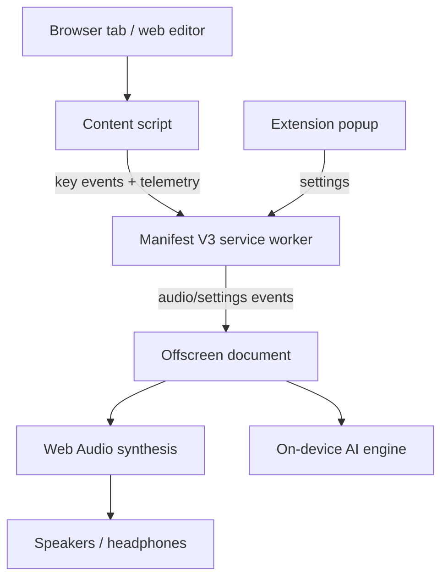

# TypeMaestro

> **A browser extension that turns typing into a responsive musical soundscape.**

TypeMaestro is a Manifest V3 Chrome extension that plays deterministic per-key instrument tones while analyzing typing rhythm to drive ambient piano generation. Audio synthesis and model inference run locally in the browser.

## Why it is interesting

The project combines browser extension architecture, real-time Web Audio synthesis, typing telemetry, and on-device inference while keeping typed text out of the processing pipeline.

## Features

- **Deterministic key-to-pitch mapping** for letters, numbers, and common control keys.
- **Five synthesized instruments**: piano, chimes, marimba, retro synth, and ethereal pad.
- **Independent audio controls** for extension power, key tones, ambient music, and volume.
- **Typing telemetry** including WPM, burstiness, backspace frequency, and pause duration.
- **Web-editor compatibility** for Monaco/VS Code Web, CodeMirror, Ace, ProseMirror, Slate, Google Docs, Notion, and standard inputs.
- **On-device model inference** using Transformers.js with `utkucoban/NanoMaestro-Realtime`.
- **Procedural fallback** when the model is unavailable or still loading.
- **Local-only processing** of typing timing metadata; text content is not stored, logged, or transmitted.
- **Audio graph cleanup** to avoid accumulating Web Audio nodes during rapid typing.

## Architecture



### Runtime responsibilities

1. **Content script** captures keyboard events in the capture phase and calculates the sliding typing telemetry window.
2. **Service worker** owns extension state and coordinates the offscreen document.
3. **Offscreen document** hosts the Web Audio engine and model inference away from the extension popup.
4. **Popup** provides controls, instrument selection, volume management, and live typing statistics.

## Technical model

| Signal | Use |
|---|---|
| WPM | Controls ambient note generation rate and timing |
| Burstiness | Influences pitch movement and velocity |
| Backspace frequency | Influences generated note velocity |
| Pause duration | Suspends ambient generation after prolonged inactivity |

## Quick start

Requirements: Node.js 18+ and a Chromium-based browser.

```bash
git clone https://github.com/anonyxhappie/TypeMaestro.git
cd TypeMaestro
npm install
npm run build
```

Then:

1. Open `chrome://extensions/`.
2. Enable **Developer mode**.
3. Select **Load unpacked**.
4. Choose the generated `dist/` directory.

## Repository layout

```text
src/
├── manifest.json   # Manifest V3 configuration
├── background.js   # Service worker and offscreen lifecycle
├── content.js     # Keyboard capture and telemetry
├── offscreen.js    # Web Audio synthesis and model inference
├── popup.html      # Extension UI
└── popup.js        # Popup state and controls

package.json
vite.config.js
```

## Privacy boundary

TypeMaestro processes typing **timing and key-type metadata** locally to calculate rhythm statistics. The privacy claim is intentionally scoped to the extension's intended processing path: typed text, passwords, and strings are not saved, logged, or transmitted.

## Project status

TypeMaestro is an actively developed browser-extension project. Browser-editor compatibility and model behavior should be validated against the current implementation before treating any integration as guaranteed.

## License

ISC.
