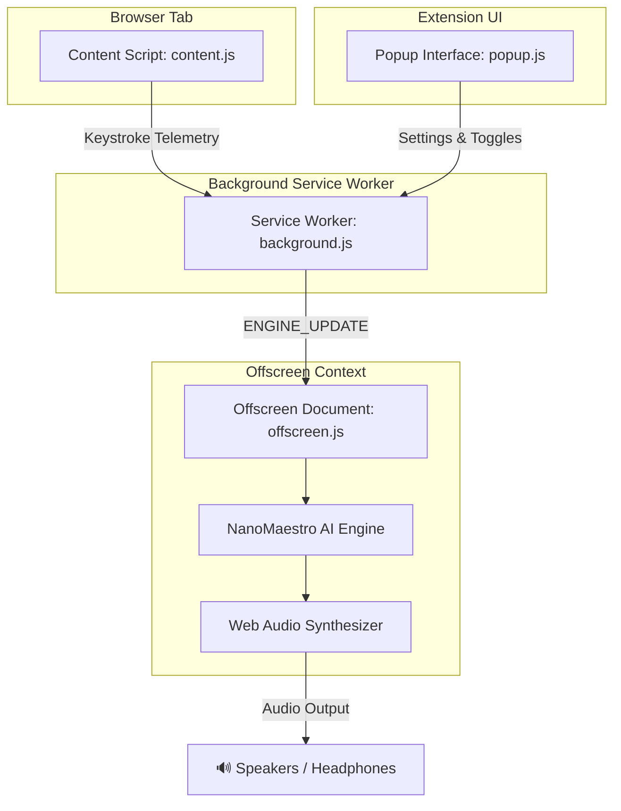

# 🎹 TypeMaestro

> **Ambient piano music dynamically matched to your typing rhythm.**

[](https://developer.chrome.com/docs/extensions/mv3/intro/)
[](https://vitejs.dev/)
[](https://huggingface.co/docs/transformers.js)
[](https://opensource.org/licenses/ISC)

**TypeMaestro** is a Manifest V3 Chrome Extension that turns your keypresses into a personalized soundscape. As you type, TypeMaestro analyzes your typing rhythm in real-time—measuring speed, burstiness, pauses, and error corrections—to synthesize responsive ambient piano melodies on the fly using a hybrid AI and Web Audio synthesis engine.

---

## 🌟 Key Features

* **⚡ Real-Time Typing Telemetry**: Analyzes keypress pace (WPM), inter-key timing variance (burstiness), backspace corrections, and activity pauses within a sliding window.
* **🎵 Interactive Keystroke Tones**: Every letter, digit, and keypress plays a unique, harmoniously mapped sequence of notes in real-time as you type.
* **🎷 Selectable Keystroke Instruments**: Choose between 5 custom Web Audio instrument timbres:
  * 🎹 **Grand Piano**: Dual-oscillator warm acoustic piano timbre.
  * 🔔 **Crystal Chimes**: Shiny high-frequency metallic bell ring with extended reverb.
  * 🪵 **Wood Marimba**: Woody percussive attack with biquad filter dampening.
  * 👾 **Retro Synthesizer**: Classic 8-bit square wave synth lead.
  * 🌌 **Ethereal Pad**: Ambient sine/triangle swell with spacious reverberation.
* **🧠 Hybrid Generative Audio Engine**:
  * **On-Device AI Inference**: Powered by [`@xenova/transformers`](https://github.com/xenova/transformers.js) running `utkucoban/NanoMaestro-Realtime` directly inside your browser.
  * **Procedural Algorithmic Fallback**: Instant fallback generator using harmonic scale intervals and dynamic velocity mapping when offline or loading the model.
* **🎛️ Mood Presets**:
  * **Deep Focus**: Steady sine waves with low reverb for concentrated work sessions.
  * **Ambient Dream**: Ethereal, slow-attack notes paired with wide convolver reverb space.
  * **Lofi Chill**: Warm triangle tones with relaxed dynamics and ambient warmth.
* **🔊 Web Audio API Synthesizer**: Custom real-time Web Audio graph featuring ADSR gain envelopes, frequency mapping, and an impulse-response convolver reverb node.
* **🔒 100% Privacy & On-Device Processing**: Keystroke timing and metrics are processed locally in temporary memory. Text content is **never** saved, logged, or sent over the network.
* **⚡ Continuous Offscreen Playback**: Employs Chrome Offscreen Documents to keep audio playback smooth and glitch-free without slowing down active tabs.

---

## 🏗️ Architecture & Data Flow

TypeMaestro uses a modular Chrome Extension (Manifest V3) architecture:



1. **Content Script (`content.js`)**: Listens to input field interactions, calculates real-time metrics (WPM, burstiness, backspaces, pause duration) over a sliding window, and emits periodic telemetry updates.
2. **Service Worker (`background.js`)**: Coordinates messaging between content scripts, the popup interface, and manages the lifecycle of the offscreen document.
3. **Offscreen Document (`offscreen.js`)**: Runs the Web Audio synthesis engine and Transformers.js model off the main thread to ensure smooth, uninhibited audio performance.
4. **Popup Interface (`popup.js` / `popup.html`)**: Sleek dark-mode UI displaying live WPM statistics, engine status toggles, preset selectors, and master volume controls.

---

## 📁 Repository Structure

```text
TypeMaestro/
├── src/
│   ├── manifest.json       # Manifest V3 extension configuration
│   ├── background.js       # Extension service worker & offscreen manager
│   ├── content.js          # Injected telemetry script for keypress tracking
│   ├── offscreen.html      # Offscreen document entry point
│   ├── offscreen.js        # Web Audio API synth & Transformers.js AI model
│   ├── popup.html          # Extension popup UI layout
│   └── popup.js            # Popup control logic & live WPM listener
├── package.json            # Dependencies & build scripts
├── vite.config.js          # Vite build config with @crxjs/vite-plugin
└── README.md               # Project documentation
```

---

## 🚀 Getting Started

### Prerequisites

* [Node.js](https://nodejs.org/) (v18 or higher recommended)
* Google Chrome or any Chromium-based browser (Brave, Edge, Vivaldi)

### 1. Installation

Clone the repository and install dependencies:

```bash
git clone https://github.com/anonyxhappie/TypeMaestro.git
cd TypeMaestro
npm install
```

### 2. Build the Extension

Run the build script to generate the production extension bundle:

```bash
npm run build
```

The compiled extension files will be created in the `dist/` directory.

> **Development Mode**: You can run `npm run dev` to launch Vite in watch mode for auto-rebuilding during extension development.

### 3. Load in Google Chrome

1. Open Google Chrome and navigate to `chrome://extensions/`.
2. Enable **Developer mode** in the top right corner.
3. Click **Load unpacked**.
4. Select the `dist` folder located inside the `TypeMaestro` project directory.
5. TypeMaestro is now installed! Pin the extension icon to your browser toolbar for quick access.

---

## 🎛️ Usage Guide

1. **Toggle Audio Engine**: Open the extension popup and use the main toggle switch to turn TypeMaestro on or off.
2. **Start Typing**: Click into any text field, text area, or editor (e.g., Google Docs, Notion, VS Code Web, Gmail) and begin typing.
3. **Customize Your Mood**:
   * Select a **Mood Preset** (*Deep Focus*, *Ambient Dream*, or *Lofi Chill*) from the dropdown menu to adjust note timbre, reverb space, and tempo dynamics.
   * Adjust the **Master Volume** slider to match your background environment.
4. **Observe Telemetry**: The popup displays your live **Typing Pace (WPM)** and engine status in real-time.

---

## 📊 Telemetry & Audio Synthesis Technical Details

| Metric | Calculation Method | Impact on Generated Audio |
| :--- | :--- | :--- |
| **WPM (Words Per Minute)** | `(Keypresses / 5) * (60,000ms / 10,000ms window)` | Modulates note generation rate and delay timing |
| **Burstiness** | Standard deviation of inter-key pause durations | Higher burstiness expands pitch octave jumps & velocity |
| **Backspace Frequency** | `Backspace Count / Total Keypresses` | Softer touch & lowered velocity during error correction |
| **Pause Duration** | Time elapsed since last keypress | Fades out generator loop during prolonged inactivity (>5s) |

---

## 🔒 Privacy & Security

* **Zero Content Logging**: TypeMaestro tracks *timing metadata* (timestamps and key types like Backspace) strictly to compute WPM and variance. Specific text entries, passwords, and typed strings are **never recorded or stored**.
* **100% Offline AI**: Model weights are cached locally via Transformers.js in browser cache. Audio generation happens entirely on your machine.

---

## 📄 License

This project is licensed under the [ISC License](file:///Users/akshay/Desktop/code/TypeMaestro/package.json#L17).

---

<p align="center">Crafted with ❤️ for deep work, focus, and mindful typing.</p>